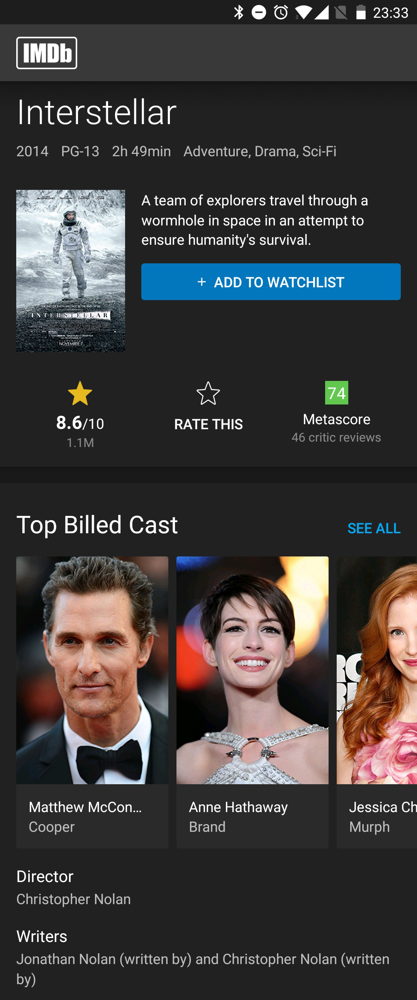

# IMDb - Interstellar

 

Voici l'écran à reproduire :

## Consignes

- Codez tout dans **'App.js'** (Votre fichier sera long, et contiendra beaucoup de CSS. Ce n'est pas grave pour cet exercice, **nous découperons plus tard les différents éléments de notre application en composants**).

- Les fichiers images devront être **inclus** dans le projet. Par [ici](https://res.cloudinary.com/lereacteur-apollo/raw/upload/v1637589064/10w-full-stack/React-Native-2021/assets_gvqswp.zip) pour télécharger les différentes assets du projet.

- Utilisez le logo **IMDb** se trouvant sur [ici](https://res.cloudinary.com/lereacteur-apollo/image/upload/v1684153265/apollo/lereacteur/React%20Native/logo-imdb_tj4n8g.png).

- Pour les **boutons**, utilisez le composant **'TouchableOpacity'** plutôt que **'Button'** car ce dernier ne permet pas d'être stylisé.

- Vous pourrez utiliser le composant **'@expo/vector-icons'** pour afficher des **icônes vectorielles**.

- Les photos des acteurs devront être **scrollables horizontalement**. Utilisez pour cela un composant **'ScrollView'** et recherchez dans la **documentation** du composant comment ajouter un scroll horizontal. Cachez ensuite la **barre de défilement**.

- Remarquez que le nom de l'acteur "Matthew McConaughey" **n'est pas entier**. Recherchez dans la **documentation** du composant **'Text'** quelle propriété utiliser pour faire tenir un texte sur une ligne (et faire apparaitre les 3 points de suspension).

- **Testez** votre application sur iOS et Android
